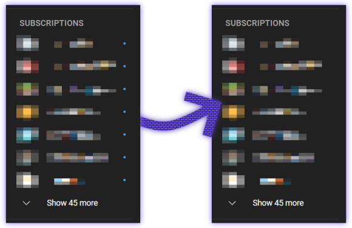

# My UserCSSs
To use them, you need to install the UserCSS menager extension like open-source [Stylus](https://github.com/openstyles/stylus).

### VDARK
Dark theme for vk.com desktop version. 

[Install](https://github.com/a0eoc/VDARK/raw/master/vdark.user.css) or read more in the [repository](https://github.com/a0eoc/VDARK).

### YouTube | Hide Newness Dots
Hides "Newless dots".

[Install](https://github.com/a0eoc/UserCSS/raw/main/YouTube.com/Hide-Newness-Dots.user.css)

### VK | Enhancements (configurable)

[Install](https://github.com/a0eoc/UserCSS/raw/main/VK.com/Enhancements.user.css)

- Ads hiding.
- Facebook reactions hiding. [Separate style](https://github.com/a0eoc/UserCSS/raw/main/VK.com/Hide-Posts-Reactions.user.css).
- FastChat disable. [Separate style](https://github.com/a0eoc/UserCSS/raw/main/VK.com/Hide-FastChat.user.css).
- Catalog disable. [Separate style](https://github.com/a0eoc/UserCSS/raw/main/VK.com/Hide-Catalog-Button.user.css).
- Stories disable.