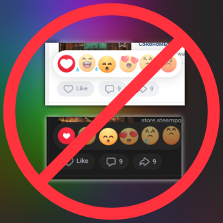
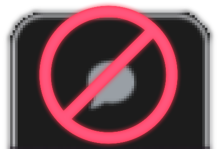
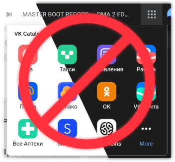

# My UserCSSs
To use them, you need to install the UserCSS menager extension like open-source [Stylus](https://github.com/openstyles/stylus).

### VDARK
Dark theme for vk.com desktop version. 

[Install](https://github.com/a0eoc/VDARK/raw/master/vdark.user.css) or read more in the [repository](https://github.com/a0eoc/VDARK).

### YouTube | Hide Newness Dots
Hides "Newless dots".

[Install](YouTube.com/Hide-Newness-Dots.user.css)

### VK | Hide Posts Reactions
Hides facebook reactions in VK. You still be able to use likes.
Included in [VDARK](https://github.com/a0eoc/VDARK).

[Install](VK.com/Hide-Posts-Reactions.user.css)

### VK | Hide FastChat
Hides FastChat.
Included in [VDARK](https://github.com/a0eoc/VDARK).

[Install](VK.com/Hide-FastChat.user.css)

### VK | Hide Catalog Button
Hides VK Group services catalog button.
Included in [VDARK](https://github.com/a0eoc/VDARK).

[Install](VK.com/Hide-Catalog-Button.user.css)

