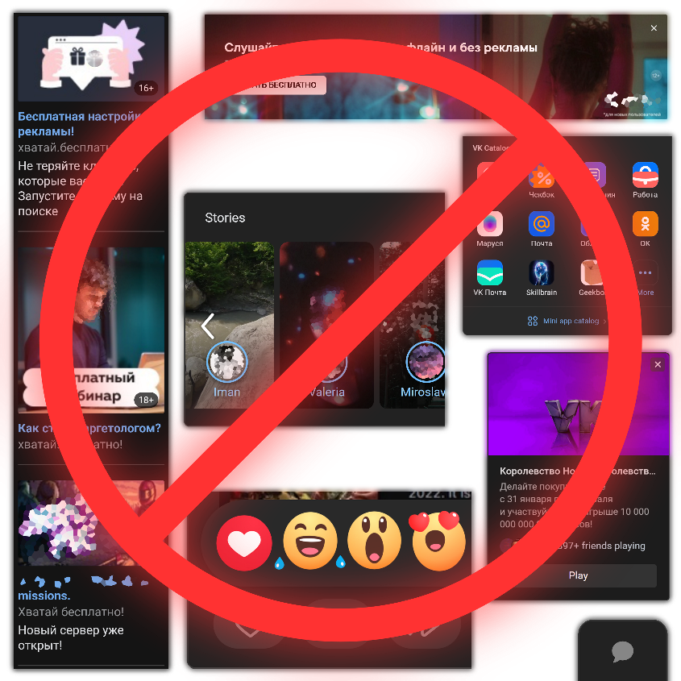

# My UserCSSs
To use them, you need to install the UserCSS menager extension such as open-source [Stylus](https://github.com/openstyles/stylus).

### VK | Enhancements

[Install](https://github.com/a0eoc/UserCSS/raw/main/VK.com/Enhancements.user.css) | [UserStyles.world](https://userstyles.world/style/4733/enhancements-for-vk)

Can hide/disable
- ads
- ecosystem catalog
- posts reactions
- "FastChat" (breaks "Messenger settings" pop-up)
- stories in feed
- calls (in both messenger page and user profiles)
- music recommendations from editors, curators, based on your and friends tastes (does not affect garbage from the "Explore" tab)
- useless music buttons (broadcast & show similar)

### YouTube | Enhancements

[Install](https://github.com/a0eoc/UserCSS/raw/main/YouTube.com/Enhancements.user.css)

Can hide/disable
- newless dots
- voice search